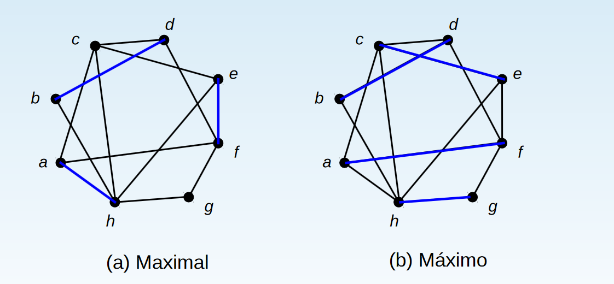

# Resumo da Prova 2 de Teoria e Aplicação de Grafos

## Arvores geradoras minimas

**Objetivo:** encontrar o conjunto de arestas de menor custo que conecte todos os vertices de um grafo.

**Requisitos:** grafo não direcionado, conexo e ponderado.

**Algoritmos:** [Prim](https://www.ime.usp.br/~pf/algoritmos_para_grafos/aulas/prim.html) ou [Kruskal](https://www.ime.usp.br/~pf/algoritmos_para_grafos/aulas/kruskal.html).

**Custo:** O(log v + log e) - pode haver variações.

**Obs:** Custo O(n²) se for matriz
### exemplo


*em verde a árvore gerado minima.*

#### Algoritmo de Prim - Pseudocódigo
```
def prim(Graph G,vertex s):
1. conjunto mst = &empty;
2. conjunto peso w[|G|]
2.1 para todo vértice v : w[v] = INF
3. conjunto de parentes parent[|G|] // para conseguir printar a MST
4. w[s] = 0
5. parent[s] = -1 // Ele nao possui pai 
6. enquanto | mst | < | V |:
    1. selecionar vértice com menor peso e que nao está no conjunto mst, v
    2. mst.insert(v) // adicionar v à mst
    3. para todo vertice u que sai de v:
        1. if(aresta e(u,v) < w[u] && u not in mst): 
            1. w[u] = e
            2. parent[u] = v
```

#### Algoritmo de Kruskal - Pseudocódigo
```
def kruskal(Graph G):
1. Ordenar todas as arestas de G em ordem crescente
2. E = vazio. E é o conjunto de arestas.
3. enquanto |E| < |V|-1:  // MST = Minimum Spanning Tree, ou seja, uma árvore e toda árvore possui v vértices e v-1 arestas
    1. e = aresta de menor valor ainda não vistada
    2. if (Inserção da ares e não forma ciclos): E.insert(e)
```

### Problema da Árvore Geradora Mínima Euclidiana
Dado N pontos no espaço cartesiano, a árvora geradora mínima euclidiana desses pontos é aquela que liga todos os pontos de tal forma que a soma do tamanho das arestas seja a menor possível. Para calcular a árvore geradora mínima euclidiana em tempo O(n logn) é necessário executar o algoritmo de triangulação de Delaunay (com custo O(n logn)) e depois o algoritmo de árvore geradora mínima com custo O(n logn).
## Cortes e Blocos

### Cortes
Remoção de um vertice V que gera 2 ou mais grafos conexos. Porém o grafo incial G não é mais conexo.

**exemplo**


### Blocos 
Um grafo conexo onde não é possível fazer cortes. 

Como é possivel ver na imagem acima, se o vertice em vermelho for retirado, não existe mais vertice de Corte, com isso é um Bloco.

#### Algoritmo para Encontrar Blocos - Pseudocódigo 
```
def Blocks(vértice i, tempo d):
1. visited[i] = True
2. time[i] = d
3. low[i] = d
4. childCount = 0
5. isArticulation = False
6. foreach n<sub>i</sub> &isin; adj[i]:   
    1. if not visited[n<sub>i</sub>]:
        1. parent[n<sub>i</sub>] = i
        2. Blocks(n<sub>i</sub>, d+1) // RECURSIVE
        3. childCount++
        4. if low[n<sub>i</sub>] &ge; low[i]:
            1. isArticulation = True
            2. backtrack from i. all vertices v such that low[v] = low[i] are in i's block.
            3. low[i] = min(low[i], low[n<sub>i</sub>])
    2. else if n<sub>i</sub> &ne; parent[i]:
        1. low[i] = min(low[i], time[n<sub>i</sub>])
```

## Grafos Bipartidos

É um tipo de grafo onde é possivel dividir os vértices em dois conjuntos distindos, ou seja, que não possuem arestas que ligam elementos do mesmo conjunto.

**Algortimo:** utilizando um DFS ou uma BFS é possível passar colorindo o grafo com 2 cores diferentes. Quando dois vertices adjacentes tem a mesma cor o grafo não é bipartido.

**Requisitos:** grafos bipartidos não possuem [ciclos impares](https://www.ime.usp.br/~pf/algoritmos_para_grafos/aulas/bipartite.html).

### código para identificar se um grafo é bipartido ou não

```C++
bool bipartite(int u){
    int ans = 1;
    for(auto v : grafo[u]){
        if(color[v] == -1){
            color[v] = !color[u];
            ans &= bipartite(v);
        }
        else
            ans &= !(color[v] == color[u]);
    }
    return ans;
}
```

### outra opção de codigo
```C++
bipartido = true;
grafo G;
bool color[];
memset(color, -1, sizeof(color))
dfs(int v, bool cor){
    color[v] = cor; //colore o verice = foi visitado
    for (i in G){
        if (G[v][i] == 1){
            if (color[i] == cor) bipartido = false;
            if(color[i] == -1) dfs(i, !cor);
         }
    }

}
```

**exemplo**


## Emparelhamento e Cobertura

### Cobertura

Conjunto de vertices que cobrem(incluem) todas as arestas.

**Cobertura Minima:** é a menor cobertura possível.

### Emparelhamento

Conjunto de arestas que não compartilham nenhum vertice terminal.

**exemplo**


*em negrito é um exemplo de emparelhamento.*

**Emparelhamento Perfeito:** é um emparelhamento que satura todos os vertices do grafo.

**Emparelhamento Maximo:** um emparelhamento que satura o maior número possivel de vertices num grafo.
```
1. começar com um emparelhamento qualquer
2. se M satura todos os vertices de X, fim!
3. se nao:
    1. escolher u em X não-saturado
    2. procurar um caminho M-aumentado com origem em u
    3. se achou, inverter arestas formando emparelhamento em u', voltar ao passo 2
    4. se não, fim!
```

**Emparelhamento Maximal:** um emparelhamento que não pode ser expandido, mas não é necessariamente o maior emparelhamento.

**Emparelhamento Estavel:** em um grafo que cada um dos conjuntos possuem prioridades, o emparelhamento estável é aquele que melhor escolhe as combinações. Podendo ser ótimo pra um conjunto ou para o outro.
``` 
Algoritmo de Gale-Shapley
1. inicializa cada pessoa como livre
2. while Existe(isFree(m) and m não propos para todas as mulheres):
    1. m = man
    2. w = primera mulher na lista m que nao foi proposta
    3. if isFree(w): m e w são unidos
    4. else if w prefere m que seu atual marido m':
           1. m e w são unidos
           2. m' é liberado
    5. else m é rejeitado por w
```

### observação

`n° de arestas do Emparelhamento Maximo == n° de vertices da Cobertura Minima`

## Algoritmo Húngaro

**Objetivo:** Minimizar o custo atravéz de operações de soma e subtração de uma matriz.

**exemplo:** [video aula](https://www.youtube.com/watch?v=sZQwhs_uDCs)

**Algoritmo**
```
Matriz(n x n)
1. de cada linha, subtrair o menor elemento
2. de cada coluna, subtrair o menor elemento
3. encontrar conjunto maximo de N' zeros independentes (nao compartilham a mesma linha nem coluna)
4. se N'= n retornar índices dos zeros
5. se não:
    1. cobrir todos os zeros com N' linhas ou colunas
    2. encontrar valor mínimo não coberto (k)
    3. subrair k dos elementos não cobertos
    4. somarar k dos elementos duplamente cobertos
    5. voltar para o passo 3
```
## Algoritmo do Leilão

Um algoritmo relacionado ao algoritmo húngaro é o algoritmo do leilão. Ele também procura maximizar/minimizar um emparelhamento com pesos. Suponha que tenhamos `j` bens e `i` compradores, e que `w[i][j]` representa o preço dado por i ao bem j.

```python
foreach good j:
    p[j] = 0
    owner[j] = NULL
queue Q starts with all bidders
up = 1/(j+1)
while not Q.empty():
    i = Q.front()
    find j that maximizes w[i][j] - p[j]
    if w[i][j] - p[j] >= 0:
        if owner[j] != NULL:
            Q.push(owner[j])
        owner[j] = i
        p[j] += up

```
### Notas
Por favor, complementem com o que acharem necessário :+1:
